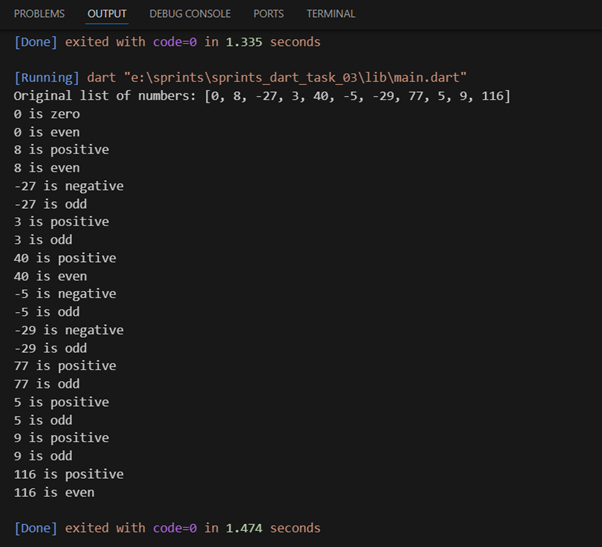

# 🔢 Number Analyzer


A comprehensive Dart program that analyzes numbers from a list, determining whether they are positive/negative and even/odd using loops and control structures.

## 📝 Description

This program showcases number analysis in Dart by performing two main checks:

1. Determines if a number is positive, negative, or zero
2. Categorizes numbers as even or odd

The program utilizes separate functions for each check, demonstrating good programming practices through code organization and reusability.
## 💻 Code 

```dart
void main() {
  List<int> numbers = [0, 8, -27, 3, 40, -5, -29, 77, 5, 9, 116];

  print('Original list of numbers: $numbers');

  for (int i = 0; i < numbers.length; i++) {
    checkPositiveOrNegative(numbers[i]);
    checkEvenOrOdd(numbers[i]);
  }
}

void checkPositiveOrNegative(int number) {
  if (number > 0) {
    print('$number is positive');
  } else if (number < 0) {
    print('$number is negative');
  } else {
    print('$number is zero');
  }
}

void checkEvenOrOdd(int number) {
  switch (number % 2) {
    case 0:
      print('$number is even');
      break;
    case 1:
      print('$number is odd');
      break;
    default:
      print('$number is invalid');
  }
}

```
## 📋 Sample Output

 
